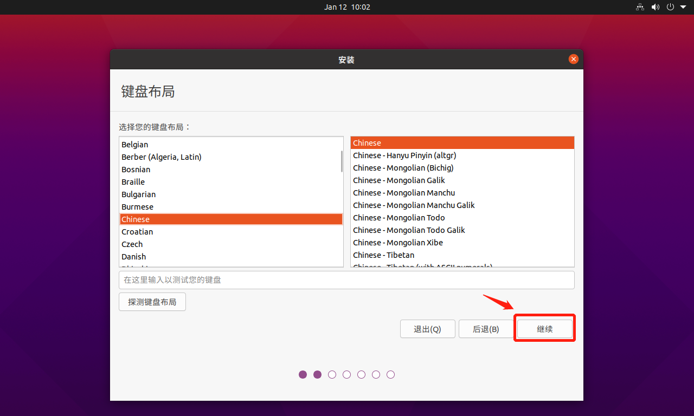

# Ubuntu 20.10桌面环境搭建

### 一、下载Ubuntu 20.10

#### 1.  百度搜索Ubuntu


#### 2. 官网下载Ubuntu 20.10


### 二、安装Ubuntu20.10

#### 1. 插入安装介质，开机


#### 2. 选择语言和键盘布局




#### 3. 选择安装的软件


#### 4. 选择安装类型并分区


#### 5. 选择地区


#### 6. 配置用户名和密码


#### 7. 开始安装


#### 8. 重启并登录


### 三、更改常用设置

#### 1. 跳过Ubuntu首次登录提示


#### 2. 设置分辨率


#### 3. 设置外观


#### 4. 设置终端


#### 5. 设置文件管理器


### 四、配置网络并安装基本软件

#### 1. 配置root密码，并切换到root用户shell

```shell
# 设置root密码
sudo passwd root
# 先输入用户密码
# 再输入两次root密码

# 切换到root用户
su - root
# 输入root密码
# 切换成功
```

#### 2. 配置网络

```shell
# 修改网络配置文件(文件在/etc/netplan目录，文件名可能与下面不同)
vi /etc/netplan/01-network-manager-all.yaml

# 修改内容如下
```


```shell
# Let NetworkManager manage all devices on this system
network:
  version: 2
  # renderer: NetworkManager
  ethernets:
    ens32:
      dhcp4: yes
      dhcp6: yes
```

```shell
# 重启网络
netplan apply
```

#### 3. 配置镜像源(这里使用清华镜像源)

```shell
# 修改apt源
vi /etc/apt/sources.list

# 修改内容如下
```


```shell
deb https://mirrors.tuna.tsinghua.edu.cn/ubuntu/ groovy main restricted universe multiverse
deb https://mirrors.tuna.tsinghua.edu.cn/ubuntu/ groovy-updates main restricted universe multiverse
deb https://mirrors.tuna.tsinghua.edu.cn/ubuntu/ groovy-backports main restricted universe multiverse
deb https://mirrors.tuna.tsinghua.edu.cn/ubuntu/ groovy-security main restricted universe multiverse
deb https://mirrors.tuna.tsinghua.edu.cn/ubuntu/ groovy-proposed main restricted universe multiverse

deb-src https://mirrors.tuna.tsinghua.edu.cn/ubuntu/ groovy main restricted universe multiverse
deb-src https://mirrors.tuna.tsinghua.edu.cn/ubuntu/ groovy-updates main restricted universe multiverse
deb-src https://mirrors.tuna.tsinghua.edu.cn/ubuntu/ groovy-backports main restricted universe multiverse
deb-src https://mirrors.tuna.tsinghua.edu.cn/ubuntu/ groovy-security main restricted universe multiverse
deb-src https://mirrors.tuna.tsinghua.edu.cn/ubuntu/ groovy-proposed main restricted universe multiverse
```

```shell
# 更新源
apt-get update
```

#### 4. 安装VMware Tools(虚拟机需要安装)

将压缩包复制到桌面


```shell
# 切换到桌面
cd /home/name/桌面

# 解压文件
tar -zxf VMwareTools-10.3.21-14772444.tar.gz

# 安装
cd vmware-tools-distrib
./vmware-install.pl

# 删除文件
cd ..
rm -rf VMwareTools-10.3.21-14772444.tar.gz vmware-tools-distrib
```

#### 5. 安装vim

```shell
apt-get install vim
```

#### 6. 安装ssh服务(用于远程登录)

```shell
# 安装openssh-server
apt-get install openssh-server

# 允许root用户登录(修改sshd_config配置文件)
vim /etc/ssh/sshd_config

# 修改配置如下
```


```shell
# 重启sshd服务
systemctl restart sshd
```

#### 7. 安装搜狗输入法

```shell
# 安装fcitx
apt-get install fcitx

# 配置fcitx
```

打开 系统设置——区域和语言——管理已安装的语言


```shell
# 从网络上下载安装包

# dpkg安装
dpkg -i sogoupinyin_2.4.0.2942_amd64.deb

# 如果安装过程中提示缺少相关依赖，则执行如下命令解决
apt-get -f install

# 再次安装
dpkg -i sogoupinyin_2.4.0.2942_amd64.deb
```

#### 8. 安装Chrome浏览器

```shell
# 从网络上下载安装包

# dpkg安装
dpkg -i google-chrome-stable_current_amd64.deb
```

#### 9. 安装vscode并配置

```shell
# 从网络上下载安装包

# dpkg安装
dpkg -i code_1.52.1-1608136922_amd64.deb

# 推荐插件列表：
#   Chinese (Simplified) Language Pack for Visual Studio Code
#   GitLens — Git supercharged
#   C/C++
#   ESLint
#   JavaScript (ES6) code snippets
#   Auto Close Tag
#   Auto Rename Tag
#   markdownlint

# 更改vscode缩放大小
```


#### 10. 安装git并配置

```shell
# 安装git
apt-get install git

# 配置git邮箱和用户名
git config --global user.email "you@example.com"
git config --global user.name "Your Name"
```

#### 11. 安装C语言编译调试环境

```shell
# 安装gcc, g++, cmake, gdb
apt-get install gcc g++ cmake gdb
```

#### 12. 安装Java开发工具包JDK

```shell
# 从网络上下载JDK(这里使用的是jdk15.0.1 deb版本)

# 安装jdk
dpkg -i jdk-15.0.1_linux-x64_bin.deb

# 配置JAVA_HOME和环境变量
vim /etc/profile

# 在结尾加上下面两条命令
export JAVA_HOME=/usr/lib/jvm/jdk-15.0.1
export PATH=$PATH:$JAVA_HOME/bin

# 配置立即生效
source /etc/profile
```

#### 13. 使用nvm安装nodejs

```shell
# 切换到本地用户
su - name

# 从git上拉取nvm
git clone https://github.com/nvm-sh/nvm.git

# 安装nvm
cd nvm
./install.sh

# 配置nvm国内镜像源
vim ~/.bashrc

# 追加如下两行
export NVM_NODEJS_ORG_MIRROR="https://npm.taobao.org/mirrors/node"
export NPM_CONFIG_REGISTRY="https://registry.npm.taobao.org"

# 配置立即生效
source ~/.bashrc

# 安装nodejs
nvm install node

# 查看npm镜像源
npm config get registry

# 设置npm镜像源
npm config set registry https://registry.npm.taobao.org

# 使用npm安装cnpm
npm install -g cnpm
```

#### 15. 安装MySQL并配置

```shell
# 切换到root用户
su - root

# 安装MySQL
apt-get install mysql-server

# 启动mysql控制台
mysql
```

```sql
# 使用mysql数据库
use mysql

# 修改root密码
ALTER USER 'root'@'localhost' IDENTIFIED WITH caching_sha2_password BY 'password';

# 允许远程登录
UPDATE user SET Host='%' WHERE User='root';
```

#### 14. 安装JetBrains软件(以idea为例)并配置

```shell
# 从网络上下载idea

# 解压
tar -zxf ideaIU-2020.3.1.tar.gz

# 运行
cd idea-IU-203.6682.168/bin
./idea.sh

# 配置桌面图标和字体大小
```


